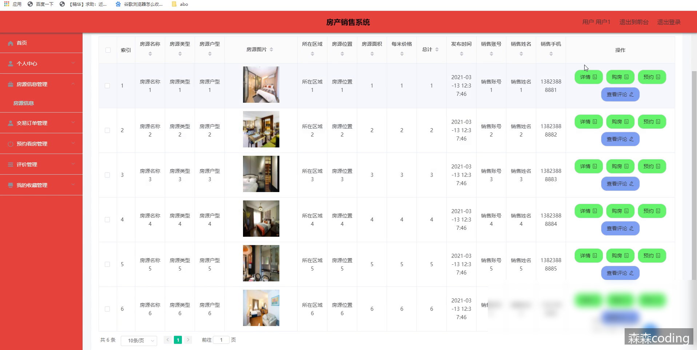
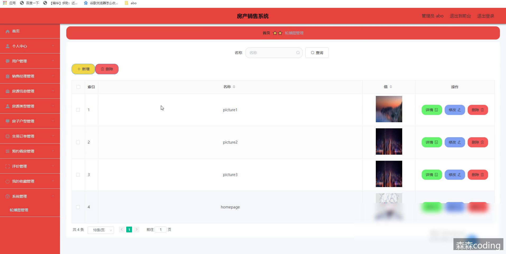
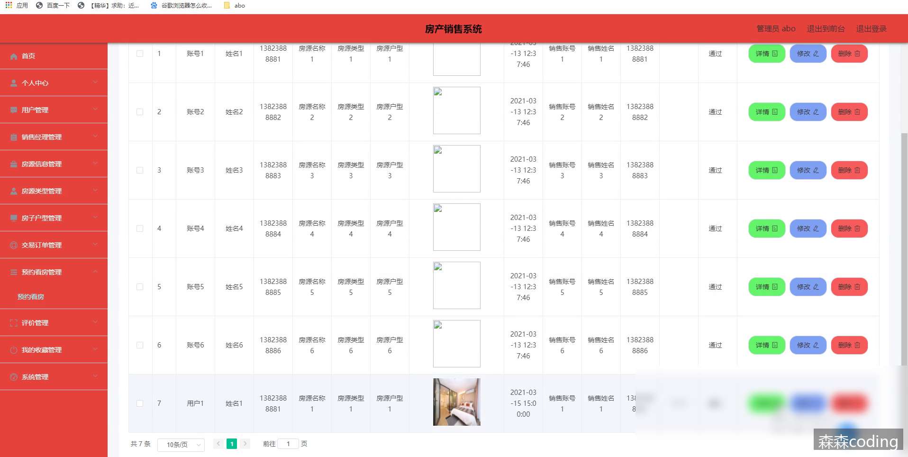

# 基于SpringBoot+Vue的房产销售系统设计附带lw与源码

> **发布时间**: 2024-01-30
> **标签**: #spring boot, #vue.js, #java-ee, #后端, #java

---

## 📞 联系方式
> 💬 **微信：sen232sen** | 🚀 **专业定制各类管理系统** | ⭐ **源码获取/技术支持**

---

##

  * 前言
  * 详细视频演示
  * 具体实现截图
  * 技术栈
  *     * 后端框架SpringBoot
    * 前端框架Vue
    * 持久层框架MyBaitsPlus
  * 系统测试
  *     * 系统测试目的
    * 系统功能测试
    * 系统测试结论
  * 为什么选择我
  * 代码参考
  * 数据库参考
  * 源码获取

## 📞 联系方式
> 💬 **微信：sen232sen** | 🚀 **专业定制各类管理系统** | ⭐ **源码获取/技术支持**

---

## 前言

🌞**博主介绍** ：✌全网粉丝25W+,CSDN特邀作者、985计算机专业毕业、某互联网大厂高级全栈开发程序员、码云/掘金/华为云/阿里云/InfoQ/StackOverflow/github等平台优质作者、专注于Java、小程序、前端、python等技术领域和毕业项目实战，以及程序定制化开发、全栈讲解、就业辅导、面试辅导、简历修改。✌🌞

> 

## 详细视频演示

请联系我获取更详细的演示视频

## 具体实现截图

  
  
  
  

## 技术栈

### 后端框架SpringBoot

Spring Boot内置了Tomcat、Jetty和Undertow等服务器，这意味着你可以直接使用它们而不需要额外的安装和配置。Spring Boot的一个主要优点是它的自动配置功能。它可以根据你的项目中的依赖关系自动配置应用程序。这使得配置应用程序变得非常容易，因为你不需要手动配置每个依赖项。Spring Boot也提供了大量的开箱即用的功能和插件，如Spring Data、Spring Security和Spring Cloud等。这些功能使得开发者可以更快速地构建应用程序，并且可以更容易地扩展和集成其他技术。它是一个非常流行的框架，它的自动配置、内置服务器和插件等功能使得开发者可以更快、更轻松地构建高质量的应用程序。

### 前端框架Vue

Vue.js的核心是虚拟DOM技术。虚拟DOM是一个内存中的数据结构，它可以帮助Vue.js实现高效的DOM操作，它采用了响应式数据绑定、虚拟DOM、组件化等现代化技术，为开发者提供了一种灵活、高效、易于维护的开发模式，当数据发生变化时，UI也会自动更新，这样就使得开发者可以更加专注于数据处理，而不是手动更新UI，这就是Vue体现出来的简洁，灵活，高效。

### 持久层框架MyBaitsPlus

MyBatis-Plus是一款基于MyBatis框架的增强工具，旨在简化MyBatis的开发。它是一款开源的Java框架，支持多种数据库，包括MySQL、Oracle、SQL Server、PostgreSQL等。MyBatis-Plus提供了丰富的API和注解，可以通过简单的配置和使用来实现ORM操作，大大减少了手写SQL的工作量。此外，MyBatis-Plus还提供了一套代码生成器，可以自动生成实体类、Mapper接口以及XML映射文件，极大地简化了开发流程。  
MyBatis-Plus还支持分页查询、动态查询、乐观锁、性能分析等实用功能，方便开发者进行高效的数据操作。通过MyBatis-Plus，开发者可以快速开发高质量的数据访问层代码，提高开发效率

## 系统测试

从多个角度进行测试找到系统中存在的问题是本系统首要的测试目的，通过功能测试寻找出系统缺陷并改正，确保系统没有缺陷。在测试过程中证明系统满足客户需求，发现问题和不足及时改正。测试完成之后得出测试结论。

### 系统测试目的

在酒店管理系统的开发周期中，系统测试是必不可少且考验耐心的过程。其重要性在于，它是保证系统质量和牢靠性的最后一道关，也是整个系统开发过程的最后一次检查。  
系统测试主要是为了避免用户在使用时发生问题，增强用户体验感，为了不影响用户的使用，我们需要从多角度、多思路去考虑系统可能遇到的问题，通过不同的模拟场景来发现缺陷并解决问题。在测试的过程中也可以了解到该系统的质量情况，系统功能是否健全，系统逻辑是否顺畅。一个合格的系统测试过程完成后将大大提升系统质量和使用感。测试的目标是验证系统是否符合需求规格说明书的定义，并找出与需求规格说明书不符合或与之冲突的内容。测试过程中一定站在用户的角度考虑问题，避免一些不切实际的场景，浪费测试时间，从而可能会引起问题导致预期结果与实际结果不符。

### 系统功能测试

对系统功能模块进行测试，通过点击、输入边界值和必填项非必填项的验证等方法进行一系列的黑盒测试。通过编写测试用例，根据测试用例中的内容进行测试，最后得出测试结论。  
登录功能测试方案：当需要登入该系统时，通过账户密码等功能点进行验证，用户在输入时需要输入与数据库内存储的数据匹配的内容，当其中某项输入错误时系统将提示输入错误。此界面对角色权限也有相应的校验，当用户角色的帐号选择管理员角色登录时，也会报错。登录功能测试用例如下表所示。

输入数据| 预期结果| 实际结果| 结果分析  
---|---|---|---  
用户名：guanliyuan 密码：123456 验证码：正确输入| 登入系统| 成功登入系统| 和估算结果一样  
用户名：guanliyuan 密码：111111 验证码：正确输入| 密码错误| 密码错误，请重新输入密码| 和估算结果一样  
用户名：guanliyuan 密码：123456 验证码：错误输入| 验证码错误| 验证码信息错误| 和估算结果一样  
用户名：空 密码：123456 验证码：正确输入| 用户名必填| 请输入用户名| 和估算结果一样  
用户名：guanliyuan 密码：空 验证码：正确输入| 密码错误| 密码错误，请重新输入密码| 和估算结果一样  
  
用户管理功能测试方案：用户管理主要有添加、编辑、删除、查找用户功能。添加用户时，必填项不填，检验系统是否有非空检验；添加已有的用户信息，检验是否提示用户名已被使用；删除用户信息，系统将检验是否进行此操作；更改用户信息，更改用户信息后页面是否可以展示出来。用户管理测试用例如下表所示。

输入数据| 预期结果| 实际结果| 结果分析  
---|---|---|---  
填入用户基本信息| 添加成功，在用户列表中显示| 该用户出现在在列表中| 和估算结果一样  
修改用户信息| 编辑成功，修改信息成功被修改| 用户信息被修改| 和估算结果一样  
选中删除用户| 系统询问是否删除用户，确认后用户被删除验证码信息错误| 系统询问是否删除用户，确认后查找不到用户信息| 和估算结果一样  
添加用户时不填用户名| 提示用户名不能为空| 提示用户名不能为空| 和估算结果一样  
填入已有用户名| 添加失败，提示用户名重复| 添加失败，提示用户名重复| 和估算结果一样  
  
### 系统测试结论

本系统主要使用黑盒测试，通过模拟用户使用系统实现各个功能编写测试用例，并进行测试。以确保系统流程的正确性。系统测试必不可少，可以使系统更加完善，该系统的可使用性也会更高。  
测试该系统主要为了验证系统的功能模块是否满足我们最初的设计理念，验证各个功能模块逻辑是否正确，此系统不需要过于复杂的逻辑处理，以便于使用者操作。测试的最终目的也是围绕着用户使用展开。测试过程中所有场景都应符合用户需求，不可偏离需求目标，遇到问题时要站在用户的角度进行思考。经过一系列的测试过程后得到最终的测试结果，从测试结果可以看出，实现的系统在功能和性能方面满足设计要求。

## 为什么选择我

## 代码参考

    @IgnoreAuth
    @PostMapping(value = "/login")
    public R login(String username, String password, String captcha, HttpServletRequest request) {
       UsersEntity user = userService.selectOne(new EntityWrapper<UsersEntity>().eq("username", username));
       if(user==null || !user.getPassword().equals(password)) {
          return R.error("账号或密码不正确");
       }
       String token = tokenService.generateToken(user.getId(),username, "users", user.getRole());
       return R.ok().put("token", token);
    }
    
    	@Override
    	public String generateToken(Long userid,String username, String tableName, String role) {
    		TokenEntity tokenEntity = this.selectOne(new EntityWrapper<TokenEntity>().eq("userid", userid).eq("role", role));
    		String token = CommonUtil.getRandomString(32);
    		Calendar cal = Calendar.getInstance();   
        	cal.setTime(new Date());   
        	cal.add(Calendar.HOUR_OF_DAY, 1);
    		if(tokenEntity!=null) {
    			tokenEntity.setToken(token);
    			tokenEntity.setExpiratedtime(cal.getTime());
    			this.updateById(tokenEntity);
    		} else {
    			this.insert(new TokenEntity(userid,username, tableName, role, token, cal.getTime()));
    		}
    		return token;
    	}

    /**
     * 权限(Token)验证
     */
    @Component
    public class AuthorizationInterceptor implements HandlerInterceptor {
    
        public static final String LOGIN_TOKEN_KEY = "Token";
    
        @Autowired
        private TokenService tokenService;
        
    	@Override
        public boolean preHandle(HttpServletRequest request, HttpServletResponse response, Object handler) throws Exception {
    
    		//支持跨域请求
            response.setHeader("Access-Control-Allow-Methods", "POST, GET, OPTIONS, DELETE");
            response.setHeader("Access-Control-Max-Age", "3600");
            response.setHeader("Access-Control-Allow-Credentials", "true");
            response.setHeader("Access-Control-Allow-Headers", "x-requested-with,request-source,Token, Origin,imgType, Content-Type, cache-control,postman-token,Cookie, Accept,authorization");
            response.setHeader("Access-Control-Allow-Origin", request.getHeader("Origin"));
    	// 跨域时会首先发送一个OPTIONS请求，这里我们给OPTIONS请求直接返回正常状态
    	if (request.getMethod().equals(RequestMethod.OPTIONS.name())) {
            	response.setStatus(HttpStatus.OK.value());
                return false;
            }
            
            IgnoreAuth annotation;
            if (handler instanceof HandlerMethod) {
                annotation = ((HandlerMethod) handler).getMethodAnnotation(IgnoreAuth.class);
            } else {
                return true;
            }
    
            //从header中获取token
            String token = request.getHeader(LOGIN_TOKEN_KEY);
            
            /**
             * 不需要验证权限的方法直接放过
             */
            if(annotation!=null) {
            	return true;
            }
            
            TokenEntity tokenEntity = null;
            if(StringUtils.isNotBlank(token)) {
            	tokenEntity = tokenService.getTokenEntity(token);
            }
            
            if(tokenEntity != null) {
            	request.getSession().setAttribute("userId", tokenEntity.getUserid());
            	request.getSession().setAttribute("role", tokenEntity.getRole());
            	request.getSession().setAttribute("tableName", tokenEntity.getTablename());
            	request.getSession().setAttribute("username", tokenEntity.getUsername());
            	return true;
            }
            
    		PrintWriter writer = null;
    		response.setCharacterEncoding("UTF-8");
    		response.setContentType("application/json; charset=utf-8");
    		try {
    		    writer = response.getWriter();
    		    writer.print(JSONObject.toJSONString(R.error(401, "请先登录")));
    		} finally {
    		    if(writer != null){
    		        writer.close();
    		    }
    		}
    //				throw new EIException("请先登录", 401);
    		return false;
        }
    }

## 数据库参考

    -- ----------------------------
    -- Table structure for token
    -- ----------------------------
    DROP TABLE IF EXISTS `token`;
    CREATE TABLE `token` (
      `id` bigint(20) NOT NULL AUTO_INCREMENT COMMENT '主键',
      `userid` bigint(20) NOT NULL COMMENT '用户id',
      `username` varchar(100) NOT NULL COMMENT '用户名',
      `tablename` varchar(100) DEFAULT NULL COMMENT '表名',
      `role` varchar(100) DEFAULT NULL COMMENT '角色',
      `token` varchar(200) NOT NULL COMMENT '密码',
      `addtime` timestamp NOT NULL DEFAULT CURRENT_TIMESTAMP COMMENT '新增时间',
      `expiratedtime` timestamp NOT NULL DEFAULT '0000-00-00 00:00:00' COMMENT '过期时间',
      PRIMARY KEY (`id`) USING BTREE
    ) ENGINE=InnoDB AUTO_INCREMENT=27 DEFAULT CHARSET=utf8 ROW_FORMAT=COMPACT COMMENT='token表';
    
    -- ----------------------------
    -- Records of token
    -- ----------------------------
    INSERT INTO `token` VALUES ('9', '23', 'cd01', 'xuesheng', '学生', 'al6svx5qkei1wljry5o1npswhdpqcpcg', '2023-02-23 21:46:45', '2023-03-15 14:01:36');
    INSERT INTO `token` VALUES ('10', '11', 'xh01', 'xuesheng', '学生', 'fahmrd9bkhqy04sq0fzrl4h9m86cu6kx', '2023-02-27 18:33:52', '2023-03-17 18:27:42');
    INSERT INTO `token` VALUES ('11', '17', 'ch01', 'xuesheng', '学生', 'u5km44scxvzuv5yumdah2lhva0gp4393', '2023-02-27 18:46:19', '2023-02-27 19:48:58');
    INSERT INTO `token` VALUES ('12', '1', 'admin', 'users', '管理员', 'h1pqzsb9bldh93m92j9m2sljy9bt1wdh', '2023-02-27 19:37:01', '2023-03-17 18:23:02');
    INSERT INTO `token` VALUES ('13', '21', 'xiaohao', 'shezhang', '社长', 'zdm7j8h1wnfe27pkxyiuzvxxy27ykl2a', '2023-02-27 19:38:07', '2023-03-17 18:25:20');
    INSERT INTO `token` VALUES ('14', '27', 'djy01', 'xuesheng', '学生', 'g3teq4335pe21nwuwj2sqkrpqoabqomm', '2023-03-15 12:56:17', '2023-03-15 14:00:16');
    INSERT INTO `token` VALUES ('15', '29', 'dajiyue', 'shezhang', '社长', '0vb1x9xn7riewlp5ddma5ro7lp4u8m9j', '2023-03-15 12:58:08', '2023-03-15 14:03:48');

## 源码获取
> 💬 **微信：sen232sen**
> 
> 🚫 **白嫖勿扰** 😊

私信联系我即可~  
大家点赞、收藏、关注、评论啦 、查看👇🏻获取联系方式👇🏻  
精彩专栏推荐订阅：在下方专栏👇🏻

> [Java精品实战案例《500套》](https://blog.csdn.net/2401_82799502/category_12569317.html)
> 
> [微信小程序项目精品案例《500套》](https://blog.csdn.net/2401_82799502/category_12569320.html)  
>  [Java核心技术精选](https://blog.csdn.net/2401_82799502/category_12566134.html)  
>  [Java框架精选](https://blog.csdn.net/2401_82799502/category_12569303.html)

---

